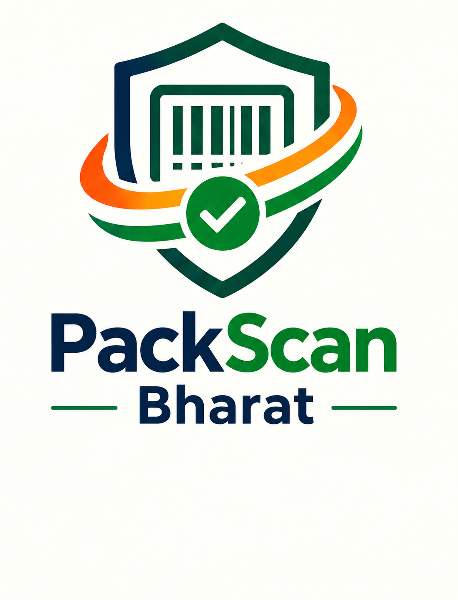
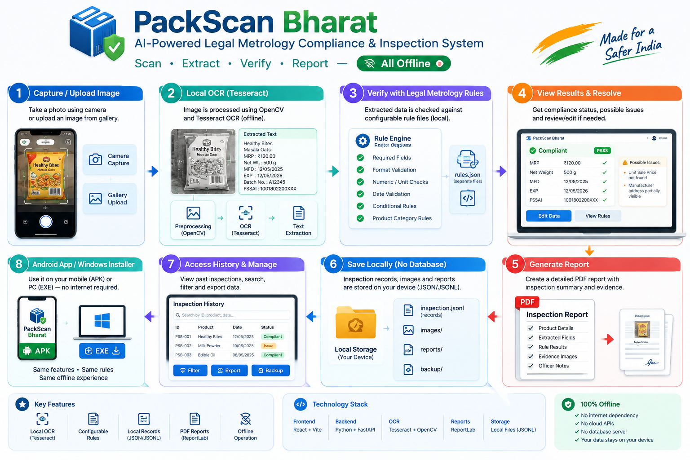

# PackScan Bharat SIH Team
## 1.Shreya Gujar.
## 2.Harshada Hinge.
## 3. Ayesha sayyad.
## 4.Vinanti Vadar.
## 5.Srushti Patil.
## 6. Harshad Teli.

## Workflow Version V1.0

# Application  in the Testing Phase
